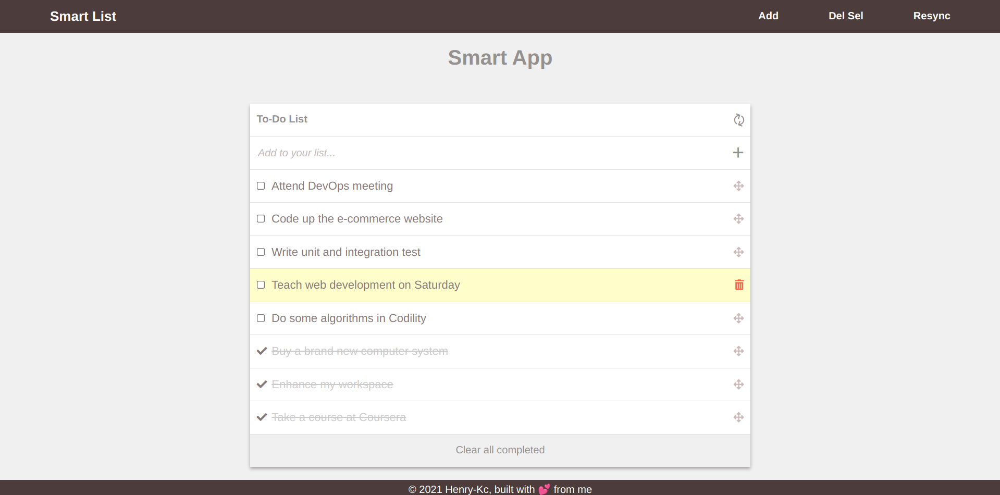

# to-do-list-draggable
A smart draggable to do list project to demonstrate my understanding of webpack bundler and ES6 syntax

## Built With

- HTML
- CSS
- JavaScript
- Webpack

## Live Demo

[Live Demo Link](https://henrykc24.github.io/to-do-list-draggable/dist/index.html)

## Getting Started

To get a local copy up and running follow these simple example steps.

Clone the repo with `git clone https://github.com/HENRYKC24/to-do-draggable.git`

Run `npm install` from the command line

Run `npx hint .` to test for html linting check

Run `npx stylelint "**/*.{css,scss}"` to test for css linting check 

The app is deployed using GitHub pages. You can view it using the 'live demo' above.

## Author

👤 **Henry Kc**

- GitHub: [@githubhandle](https://github.com/henrykc24)
- Twitter: [@twitterhandle](https://twitter.com/henrykc24)
- LinkedIn: [LinkedIn](https://linkedin.com/in/henry-kc)

## 🤝 Contributing

Contributions, issues, and feature requests are welcome!

Feel free to check the [issues page](https://github.com/HENRYKC24/to-do-draggable/issues/).

## Show your support

Give a ⭐️ if you like this project!

## Acknowledgments

- A special thanks to Microverse for inspiring this project. I indebted to you all at Microverse
- A special thanks goes to all my peers at Microverse for being ther for me.

## 📝 License

This project is [MIT](./LICENSE) licensed.
